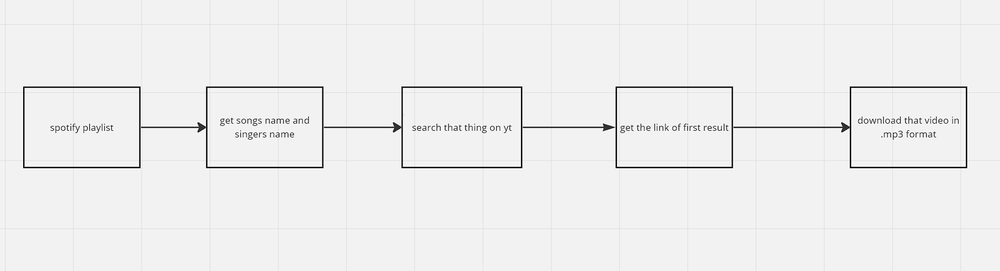

# spotify2mp3

Download spotify playlists, songs and albums as .mp3 files.

## TODO:
- [ ] Download to custom path
Note: Downloading custom path removes multiple downloads, we need both
- [ ] Integrate `ytmp3-dl` in the script, no more `os.system()`